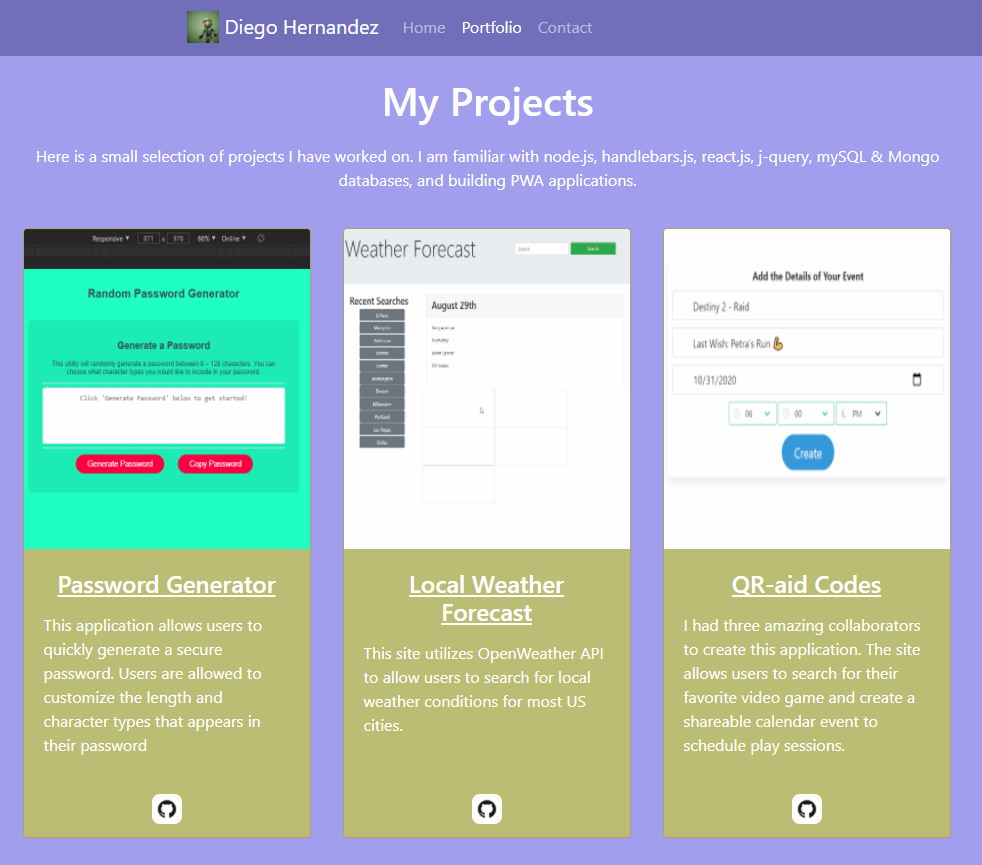

# My Portfolio

Gooday fellow travelers,

I am a full stack web developer with a pashion for gaming and an 

This build of my portfolio is made with handlebars.js and utliizes Bootsrap for mobile responsiveness. I am currently working on rebuilding my porfolio in react.js with a lot of visial changes 😁

[My Online Portfolio](https://diegopie.herokuapp.com/) is hosted on Heroku.

## Key Technologies I Know (So Far 😎)

- HTML/CSS
- Intergrating 3rd Party APIs
- JavaScript/jQuery
- Node.js/Express Servers
- handlebars.js
- react.js
- mySQL/Mongo Databases
- Service Workers/PWAs
- MERN Stack
- Sundry Assormtent of JavaScript packages (Don't ask me why, but uuid currently holds a special place in my heart)

## Contact Me

[View my contact page](https://diegopie.herokuapp.com/contact) or reach me directly at diegopie@outlook.com!

This application was authored by [Diego Hernandez](https://github.com/Diegopie)